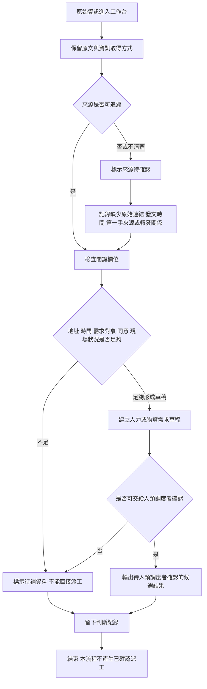

# 資訊流程設計

> 這份文件是 Codex 依照 `docs/decisions.md` 先整理的流程草稿。Mermaid 流程圖仍需要人類在 VS Code 預覽並檢查是否合理。

## 我的 v1 目標

- 我優先服務的使用者：資訊整理者。
- 這個使用者最想完成的事：把原始資訊整理成可供人類確認的草稿，標出來源風險、缺漏欄位與可能的人力需求。
- 我最想避免的錯誤：把未確認資訊、人力需求草稿或轉發貼文顯示成已確認，讓使用者誤以為可以直接派工。

## 自然語言流程描述

```text
原始資訊進入工作台後，資訊整理者先保留原文，不把它改寫成已確認事實。

整理者先查看資訊取得方式、原始查核狀態與原文內容。如果資料來自社群貼文、截圖或轉發，系統提醒整理者確認原始連結、發文時間、發文者是否第一手、轉發者和事件的關係，以及是否可能是舊消息。

接著整理者檢查這筆資訊是否缺少關鍵欄位，例如地址、時間、需求對象、當事人同意、現場狀況或第二個獨立來源。如果缺少關鍵欄位，就標示為需要人工確認，並留下缺漏原因。

如果資訊看起來有整理價值，整理者可以先建立人力或物資需求草稿。人力需求草稿可以包含清理泥沙、搬運物資、醫療協助、交通接送、物資整理或聯絡確認。物資需求草稿可以包含飲食物資、衣物用品、清潔用品、醫療用品、住宿用品、工具器材、通訊與電力、搬運與交通用品。

建立草稿後，整理者仍然要檢查這筆資訊是否能交給人類調度者確認。如果來源、時間、地點、需求對象或現場狀況仍不足，就暫時保留為待補資料，不能變成調度候選。

如果整理者判斷資料足夠進入下一步，就輸出為「待人類調度者確認」的候選結果。這不是已確認派工，也不能由 AI 決定要不要派人或派多少人。

每一次標示需要人工確認、暫時不採用、建立需求草稿或輸出候選結果，都要留下判斷紀錄，讓下一位協作者知道為什麼這樣整理。
```

## Mermaid 流程圖

請用 VS Code 預覽，確認流程圖能正常顯示。



## 人工確認點

- 轉發貼文是否有原始連結，以及發文時間是否明確。
- 發文者是否為第一手來源，或只是轉述者。
- 轉發者和事件的關係是否清楚。
- 這筆資訊是否可能是舊消息。
- 地址、時間、需求對象、當事人同意與現場狀況是否足夠。
- 人力需求類型是否合理，例如清理泥沙、搬運物資、醫療協助、交通接送、物資整理或聯絡確認。
- 物資需求類型是否合理，例如飲食物資、衣物用品、清潔用品、醫療用品、住宿用品、工具器材、通訊與電力、搬運與交通用品。
- 是否能交給人類調度者確認。

## 不能自動處理的分支

- AI 不能自動判斷貼文是否真實。
- AI 不能自動判斷來源可信度。
- AI 不能自動把社群貼文或截圖升級成已確認來源。
- AI 不能自動決定是否派人去現場。
- AI 不能自動決定要派多少人。
- AI 不能把人力或物資需求草稿顯示成已確認調度結果。

## 操作或判斷紀錄

- 標示來源待確認時，要記錄缺少哪一種來源資訊。
- 標示待補資料時，要記錄缺少地址、時間、需求對象、當事人同意、現場狀況或第二個獨立來源。
- 建立人力或物資需求草稿時，要記錄這只是草稿，不是已確認需求。
- 輸出候選結果時，要記錄是「待人類調度者確認」，不是已確認派工。
- 暫時不採用資訊時，要記錄不採用原因，避免下一位協作者重複誤判。

## 我檢查後修正了什麼

- 原本：流程容易把人力需求整理和派工決策放在一起。
- 修正後：流程把「建立人力或物資需求草稿」和「是否可交給人類調度者確認」分成兩個節點，最後也明確寫出本流程不產生已確認派工。
- 為什麼：符合 `docs/design-checklist.md` 對人工確認的要求，也避免讓 AI 或工作台看起來像是在做真實救災派工。

## 我仍不確定的流程點

- 人力需求欄位要用固定選項，還是讓整理者自己補充。
- 物資分類要做到多細，才不會讓整理者負擔太重。
- 只有截圖、沒有原始連結時，要直接暫時不採用，還是保留為待補資料。
- 「第二個獨立來源」要做成必要欄位，還是只作為人工確認提醒。
- 交給人類調度者確認之前，最低限度需要哪些欄位。
